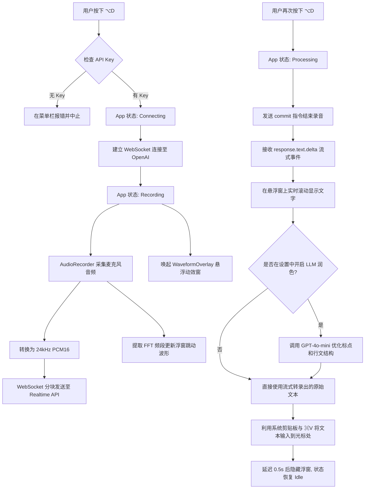

# WhisperType v2: 架构与实现原理解析

本文档记录了 WhisperType 从传统的“录完再转录”模式，向基于 OpenAI Realtime API 的“流式边说边转录”模式（ChatGPT 风格交互）升级的全过程。

---

## 1. 整体需求与目标

**核心目标**：在 macOS 上构建一个极速、丝滑的中英双语原生语音输入工具。

- **交互体验**：全局快捷键（`⌥D`）一键唤醒，伴随类似 ChatGPT App 的全局悬浮动效波形窗口。
- **低延迟处理**：本地提取 PCM 后，直通 OpenAI Whisper API，高精度极速转录。
- **原汁原味**：支持中英文混合输入，**绝对不翻译**，保留所有的专业术语（如 Xcode, SwiftUI），并自动加上正确的标点符号。
- **系统原生**：零外部庞大依赖（如 Python 进程），完全使用 Swift 构建，资源占用极低。
- **防止超限**：设定单次最高 5 分钟（300s）的安全硬限制，保障转录请求绝对不会由于文件过大而失败。

---

## 2. 系统设计与技术选型

为了实现上述目标，我们全面采用最稳定高精度的架构：

- **核心通信**：采用 `URLSession` 直连 **OpenAI Whisper API** (`/v1/audio/transcriptions`)。
- **音频要求**：将 AVAudioEngine 的音频在本地快速处理为 Whisper 兼容的 WAV 格式。
- **状态管理**：使用 SwiftUI 的 `@StateObject (AppState)` 构建状态机，管理 `Idle` -> `Recording` -> `Processing` 的严格状态流转。包含 5 分钟倒计时保护。
- **UI 呈现**：使用 AppKit 的 `NSPanel (LSUIElement)` 创建一个永远不会抢夺用户当前输入焦点的透明悬浮窗，用于渲染实时波形和倒计时。

---

## 3. 核心模块开发与测试

项目被拆分为四个核心模块进行独立开发与验证：

### A. 录音与音频处理 (`AudioRecorder.swift`)
- **音频采集**：利用 `Accelerate` 框架对麦克风音频进行 FFT（快速傅里叶变换），提取 7 个频段的能量值，驱动 UI 的波形动画。
- **格式封装**：结束录音后，在本地将 PCM 音频实时压制拼接为标准的 WAV 头部格式，以符合 OpenAI 的上传标准。

### B. 悬浮窗动效交互 (`WaveformOverlay.swift` & `OverlayWindowController.swift`)
- 使用 `AngularGradient` 配合 `@State` 动画实现彩色光环的无限旋转。
- 通过绑定 `AppState` 中的频段数组，让波形柱的高度随说话声音实时跳动。
- 附带一个实时更新的时间标签，如 `Recording... 4:30 / 5:00`，在快超时前自动变红并加入警告图标。

### C. 网络请求与后处理 (`TranscriptionService.swift` & `TextPostProcessor.swift`)
- **Whisper 调用**：采用 HTTP Multipart 表单形式，携带 API Key、WAV 文件以及可选的 Language Hint 上传至 OpenAI。
- **可选后处理**：提供一个使用 GPT-4o-mini 的深度润色开关，用于去除严重的口语化重复并优化排版（不改变原意）。

---

## 4. 系统集成与工作流

整合所有模块，确保从快捷键按下到文字上屏的无缝协作：

1. `HotKeyManager` 全局拦截 `Option + D`。
2. 触发 `AppState` 开始录音和网络推流。
3. 录音结束，等待文本流完毕。
4. 使用 macOS Accessibility 权限，通过底层 API（`CGEvent` / 剪贴板）将最终文本注入到用户当前光标所在的任何第三方应用中。

---

## 5. API 运行费用评估 (Cost Analysis)

流式体验的代价是相对较高的 API 成本，本项目主要涉及以下两项消耗：

1. **OpenAI Whisper API (`whisper-1`)**
   - 官方定价：**$0.006 / 分钟**。
   - 极其低廉的成本，每使用 1 小时语音输入仅需 $0.36（约合人民币 2.5 元）。
   - 由于增加了硬性 5 分钟安全限制，即使不小心忘记关麦克风，一次最坏消耗也仅为 3 美分。

2. **GPT-4o-mini (可选的文本深度润色)**
   - 如果开启该功能，会在转录完成后消耗少量的文本 Token。
   - 成本极低，平均每转录一次约 **$0.0001**。

---

## 6. 系统交互流程图

以下是 WhisperType v2 核心运行逻辑的详细流程图：

---

## 7. 踩坑记录与核心技术攻坚 (Debug Lessons)

在实际开发与调试过程中，我们遇到并解决了一系列深度技术难题：

### 7.1 取消流式，回归纯听写
最初我们尝试了 OpenAI Realtime API (`gpt-4o-realtime-preview`) 以获得类似 ChatGPT App 的流式打字效果。但在深度使用中发现，原生的多模态 LLM 极具**“幻觉与自作聪明的润色倾向”**。尽管加入了强硬的 `[TRANSCRIPT_START]` 提示词防御，模型依然偶尔会擅自修改用户的句型（例如把“几周之内”改写为“只有这样”）。
对于严肃的输入工具而言，“忠实于原话”远比“流式动画”重要。因此我们痛定思痛，**彻底移除了 Realtime 接口**，将底层管线全部重新对齐回纯净、绝对忠实的 `whisper-1` 模型。

### 7.2 5分钟安全限时机制
OpenAI Whisper REST 接口拥有 25MB 的上传上限（在 24kHz 音频下约折合 8.5 分钟）。为了防止用户忘关麦克风导致大文件上传失败，我们在 `AppState.swift` 的心跳 Timer 中加入了硬性熔断限制：**到达 300 秒（5 分钟）强制停止并转录**，并在浮窗上加入倒计时警告。

### 7.2 macOS 辅助功能权限的“静默拦截”
为了实现全自动的 `⌘V` 粘贴，App 需要调用底层的 `CGEvent` API 模拟按键。然而在 Xcode 调试环境下，每一次 `⌘R` 重新编译都会改变二进制签名，导致 macOS **在没有任何弹窗提示的情况下默默没收权限**，造成粘贴无响应。
**解决方案**：在 App 启动的第一秒（`AppState.init`），强制调用底层的 C API `AXIsProcessTrustedWithOptions` 并开启弹窗选项。这迫使系统必须显式向用户弹出权限请求框，彻底杜绝了静默拦截。

### 7.3 LSUIElement 与焦点抢夺
当 WhisperType 被配置为常规应用（带有 Dock 栏图标）时，操作它会**导致当前输入框丢失焦点**。这会导致最终生成的文字被粘贴给了 WhisperType 自己。
**解决方案**：将 App 严格设定为 `LSUIElement = true`（纯后台/菜单栏应用）。并且移除了剪贴板的“0.3秒用完即焚”逻辑，确保文字永久保留在剪贴板中，即便是遇到权限拦截，用户也能手动按下 `⌘V` 挽救转录结果。

### 7.4 “刘海屏”吞没图标与 Settings 逃逸
在 MacBook 刘海屏上，如果右上角后台应用过多，WhisperType 的系统菜单栏图标会被刘海物理隐藏，导致用户无法进入设置界面。
**解决方案**：我们在 `HotKeyManager` 中加入了一个专门的全局备用快捷键（`Option + S`）。同时绕过了 SwiftUI 在无菜单栏应用中调用 `openSettings()` 时常失灵的 Bug，手写了原生的 `SettingsWindowController` 来强行拉起设置面板。
